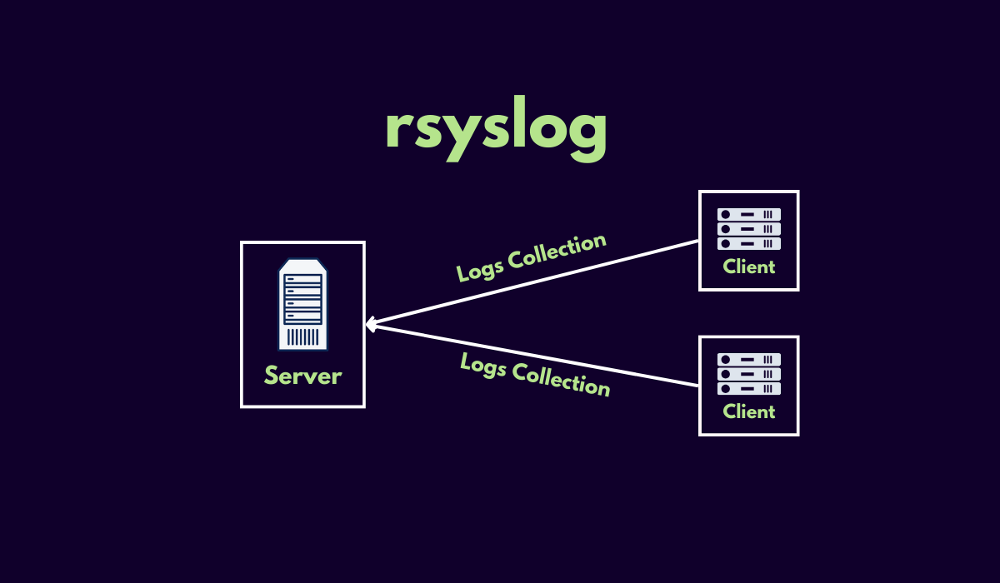

# Linux - Configuration et Utilisation de Rsyslog



## Introduction

Rsyslog est un démon puissant et flexible pour la gestion des journaux système sur les serveurs Linux. Il permet de centraliser, d’analyser et de transférer les journaux provenant de diverses applications et systèmes. Ce guide explique comment installer, configurer et utiliser Rsyslog efficacement, avec des exemples pratiques.

---

## Pourquoi utiliser Rsyslog ?

- **Centralisation des logs** : Rsyslog peut regrouper les journaux de plusieurs machines sur un serveur central.
- **Flexibilité** : Les journaux peuvent être filtrés, triés et formatés.
- **Compatibilité** : Supporte divers protocoles (TCP, UDP, RELP) et formats de logs.
- **Évolutivité** : Gère un grand volume de journaux dans des environnements complexes.

---

## Partie 1 : Utilisation via docker

Nous allons maintenant faire un maximum de choses via docker, car pour les étudiants sur windows et mac les outils que nous allons voir ne peuvent tout simplement pas fonctionner.

### Étape 1.1 : Installer docker si non présent sur votre système

Je vous invite à aller consulter la documentation de docker desktop.

### Étape 1.2 : Créer le Fichier **docker-compose.yml**

Nous allons définir deux services :
\- Le serveur Rsyslog qui écoute les logs envoyés par les clients.
\- Un client Rsyslog qui génère et envoie ses logs.

Créez un fichier docker-compose.yml :
```yaml

services:
  rsyslog-server:
    image: rsyslog/syslog_appliance_alpine
    container_name: rsyslog-server
    hostname: rsyslog-server
    volumes:
      - ./server/rsyslog.conf:/etc/rsyslog.conf
      - ./server/logs:/var/log
    ports:
      - "514:514/udp"
      - "514:514/tcp"
    networks:
      - rsyslog-net

  rsyslog-client:
    image: rsyslog/syslog_appliance_alpine
    container_name: rsyslog-client
    hostname: rsyslog-client
    volumes:
      - ./client/rsyslog.conf:/etc/rsyslog.conf
    depends_on:
      - rsyslog-server
    networks:
      - rsyslog-net

networks:
  rsyslog-net:
```

N'éxecutez pas ce fichier tout de suite

## Partie 2 : Configuration de Base de Rsyslog

### Étape 2.1 : Configuration du Serveur Rsyslog

1. Créez le dossier pour le serveur Rsyslog :

```bash
mkdir -p server/logs
```

2. Créez et éditez server/rsyslog.conf :
```text
# /etc/rsyslog.conf configuration file for rsyslog
#
# For more information install rsyslog-doc and see
# /usr/share/doc/rsyslog-doc/html/configuration/index.html
#
# Default logging rules can be found in /etc/rsyslog.d/50-default.conf


#################
#### MODULES ####
#################

module(load="imuxsock") # provides support for local system logging
#module(load="immark")  # provides --MARK-- message capability

# provides UDP syslog reception
#module(load="imudp")
#input(type="imudp" port="514")

# provides TCP syslog reception
#module(load="imtcp")
#input(type="imtcp" port="514")

# provides kernel logging support and enable non-kernel klog messages
module(load="imklog" permitnonkernelfacility="on")

###########################
#### GLOBAL DIRECTIVES ####
###########################

# Filter duplicated messages
$RepeatedMsgReduction on

#
# Set the default permissions for all log files.
#
$FileOwner syslog
$FileGroup adm
$FileCreateMode 0640
$DirCreateMode 0755
$Umask 0022
$PrivDropToUser syslog
$PrivDropToGroup syslog

#
# Where to place spool and state files
#
$WorkDirectory /var/spool/rsyslog

#
# Include all config files in /etc/rsyslog.d/
#
$IncludeConfig /etc/rsyslog.d/*.conf

#################################
#### COMMANDES POUR LE COURS ####
#################################

module(load="imudp") # Active UDP
input(type="imudp" port="514")

module(load="imtcp") # Active TCP
input(type="imtcp" port="514")

# Stocker tous les logs reçus dans un fichier dédié
*.* /var/log/remote.log
```

Je vous invite à regarder la partie du bas du fichier. Nous declarons quel ports ecouter et dans quel fichier ecrire.


### Étape 2.2 : Configuration du Client Rsyslog

1. Créez le dossier pour le client Rsyslog :

```bash 
mkdir client
```

2. Créez et éditez client/rsyslog.conf :

```text
# /etc/rsyslog.conf configuration file for rsyslog
#
# For more information install rsyslog-doc and see
# /usr/share/doc/rsyslog-doc/html/configuration/index.html
#
# Default logging rules can be found in /etc/rsyslog.d/50-default.conf


#################
#### MODULES ####
#################

module(load="imuxsock") # provides support for local system logging
#module(load="immark")  # provides --MARK-- message capability

# provides UDP syslog reception
#module(load="imudp")
#input(type="imudp" port="514")

# provides TCP syslog reception
#module(load="imtcp")
#input(type="imtcp" port="514")

# provides kernel logging support and enable non-kernel klog messages
module(load="imklog" permitnonkernelfacility="on")

###########################
#### GLOBAL DIRECTIVES ####
###########################

# Filter duplicated messages
$RepeatedMsgReduction on

#
# Set the default permissions for all log files.
#
$FileOwner syslog
$FileGroup adm
$FileCreateMode 0640
$DirCreateMode 0755
$Umask 0022
$PrivDropToUser syslog
$PrivDropToGroup syslog

#
# Where to place spool and state files
#
$WorkDirectory /var/spool/rsyslog

#
# Include all config files in /etc/rsyslog.d/
#
$IncludeConfig /etc/rsyslog.d/*.conf

#################################
#### COMMANDES POUR LE COURS ####
#################################

*.* @rsyslog-server:514  # Envoie des logs via UDP
*.* @@rsyslog-server:514 # Envoie des logs via TCP
```

Rappel: rsyslog-server est une **url**, cette dernière est le nom du serveur sur le reseau docker, dans la vrai vie cela serait soit une ip soit un nom de domaine.

---

## Partie 3 : Lancer les Conteneurs

### Étape 3.1 : Activer la réception des journaux distants

1. Démarrer l’environnement Docker :
   ```bash
   docker-compose up -d
   ```

2. Vérifier que les conteneurs tournent :
   ```text
   docker ps
   ```
---

## Partie 4 : Tester la Configuration

### Étape 4.1 : Générer un Log sur le Client

1. Accédez au conteneur client :

   ```bash
   docker exec -it rsyslog-client sh

   ```
2. Générez un log avec la commande logger :
   ```bash
   logger "Test de log depuis le client Rsyslog"
   ```


###  Étape 4.2 : Vérifier les Logs sur le Serveur
Accédez au conteneur serveur :

   ```bash
   docker exec -it rsyslog-server sh
   ```

Consultez les logs reçus :

   ```bash
   tail -f /var/log/remote.log
   ```

Vous devriez voir apparaître votre message envoyé depuis le client.

